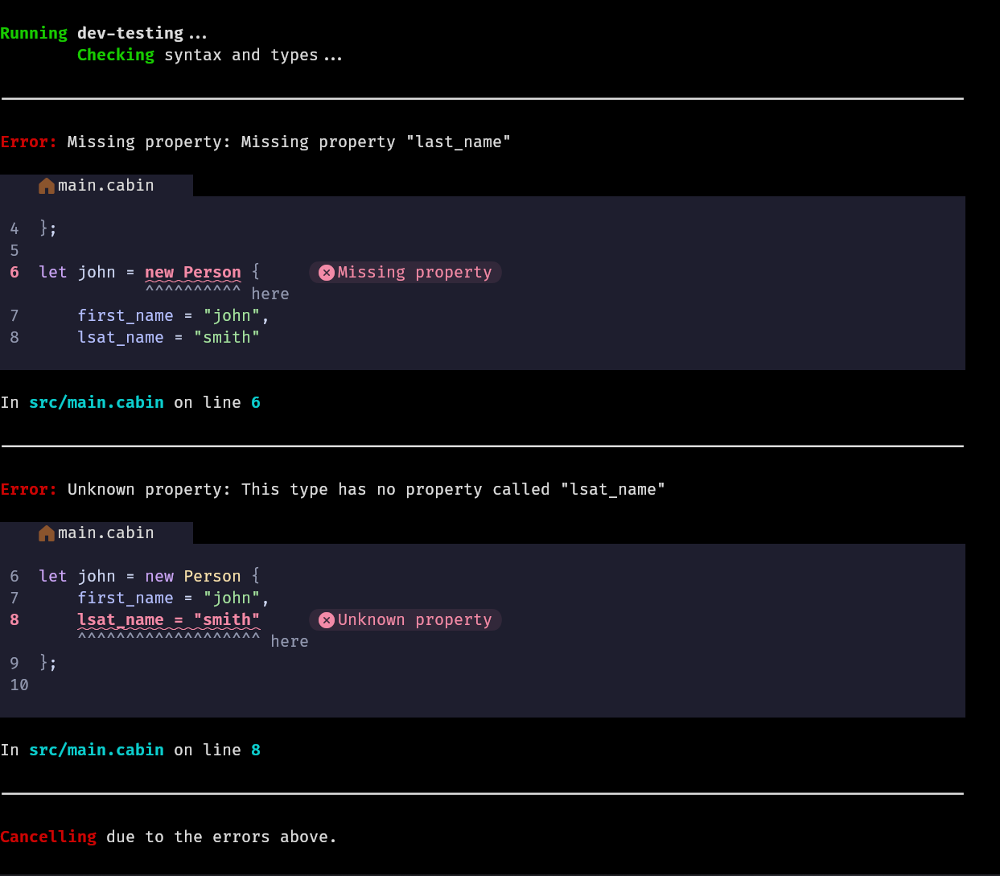

# Cabin

**Warning: Cabin is in pre-alpha. It is still in active development and *won't* work, not even for small or experimental projects. Note that items that are not checked off are either currently unfinished or not even started.**

A dead simple, highly performant, extremely safe programming language.

## Installation

Cabin is not yet available for installation, because it's *that* early on. It will release in 0.1 for alpha testing.

## Philosophy & Motivation

Cabin has three "core values":

- Simplicity
- Safety
- Performance

Above all else, Cabin aims to be a dead simple language that anyone can learn in almost no time, while not compromising on performance or safety.

Cabin aims to fill the "missing hole" in the intersection of these three values:

There are other attempts to fill this hole as well, such as Nim and V. This is just one of them.

Cabin is primarily inspired by Lua, Rust, Go, and Zig, except it aims to be type-safer than Lua, simpler than Rust, faster than Go, and memory-safer than Zig. That is the niche Cabin aims to fill.

## Tooling

By default, the Cabin compiler comes with the following tools:

- [x] Project Creator: Creates new Cabin projects with a set up config file and source folder.
- [x] Runner: Runs Cabin code without outputting any permanent files
- [x] Project Configurer: Changes compiler options for a given project
- [x] Linter: Provides code diagnostics including errors, warnings, hints, and information.
- [ ] Compiler: Compiles Cabin code to native binary executable
- [ ] Formatter: Formats Cabin code to a single unified style
- [ ] Transpiler: Transpiles Cabin code to C
- [ ] Package Manager: Manages Cabin dependencies, publishes cabin packages, etc.

## Hooks

Below are some things that might make Cabin attractive.

### Readable Errors

Cabin has had special care given to its error messages, providing detailed, readable, and clear errors.

### Simple Syntax

Cabin is designed to be dead simple. The language only has 17 keywords, and the grammar is absolutely tiny; [The Extended Backus-Naur Form grammar](https://cabin-language.org/reference/syntax) is **less than 100 lines**. For reference, [an EBNF grammar for C](https://gist.github.com/Chubek/52884d1fa766fa16ae8d8f226ba105ad) is 360+ lines, [one for JavaScript](https://gist.github.com/Chubek/0ab33e40b01a029a7195326e89646ec5) is 370+, and [one for Python](https://docs.python.org/3/reference/grammar.html) is 830+. Obviously, these metrics don't mean too much, given how affected they are by whitespace and preferential rule splitting, but it's food for thought.

The language intentionally avoids adding sugar for existing syntax; There's almost always just one way to do something.

## Philosophy

If it can be done readably with existing syntax, it should be.

Readable is good; traditional is not necessarily so.

Software can be complete.
